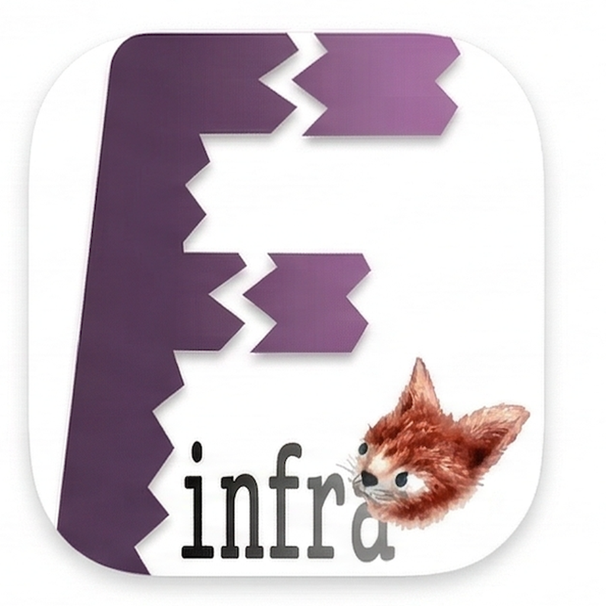

#  [fBanner](https://finfra.kr/product/fBanner/kr/index.html)

> **복사하는 순간, 배너 이미지가 완성됩니다.**

macOS 메뉴 바 앱으로, URL이나 텍스트를 복사하면 자동으로 배너 이미지를 생성합니다.

## 주요 기능

- **즉시 접근** - `Cmd+Shift+K` 단축키로 바로 실행
- **클립보드 자동화** - 복사한 URL/텍스트를 자동 감지
- **다양한 포맷** - PNG 다운로드, 그리드 레이아웃 조정
- **메뉴 바 통합** - 시스템 메뉴 바에 상주
- **생성 히스토리** - 이전에 생성한 이미지 재사용
- **다국어 지원** - 영어, 한국어, 일본어, 중국어

## 요구 사항

- macOS 14.0 이상

## 제품 페이지

| 언어 | 링크 |
|------|------|
| English | [fBanner - Product Page](https://finfra.kr/product/fBanner/en/index.html) |
| 한국어 | [fBanner - 제품 페이지](https://finfra.kr/product/fBanner/kr/index.html) |

### 다른 finfra 앱

| 앱 | 설명 | 링크 |
|----|------|------|
| fSnippet | 모든 텍스트의 확장, 강력한 스니펫 도구 | [제품 페이지](https://finfra.kr/product/fSnippet/kr/index.html) |
| fWarrange | 가장 완벽한 Mac 창 관리, 손쉬운 레이아웃 복원 | [제품 페이지](https://finfra.kr/product/fWarrange/kr/index.html) |
| fBoard | 나만의 맞춤형 스크린 보드 | [제품 페이지](https://finfra.kr/product/fBoard/kr/index.html) |
| fQRGen | 클립보드를 복사하는 순간, QR 코드가 완성 | [제품 페이지](https://finfra.kr/product/fQRGen/kr/index.html) |
| fGoogleSheet | 내 맥에서 가장 빠른 구글 시트 메뉴바 앱 | [제품 페이지](https://finfra.kr/product/fGoogleSheet/kr/index.html) |

## 문서

| 문서 | 설명 |
|------|------|
| [매뉴얼](./manual/) | 사용자 매뉴얼 (한/영) |
| [REST API](./api/) | REST API 레퍼런스 및 OpenAPI 스펙 |
| [MCP 서버](./mcp/) | Model Context Protocol 서버 |
| [Claude Code 스킬](./agents/claude/) | Claude Code 플러그인 |
| [다국어 리소스](./localization/) | 다국어 문자열 리소스 |
| [리소스](./resource/) | 테스트용 예제 입출력 파일 |

## 커뮤니티 및 지원

### 이슈
- [GitHub Issues](https://github.com/Finfra/fBanner_public/issues)

### 게시판 (English)
| 카테고리 | 링크 |
|----------|------|
| Notice | [fBanner Notice](https://finfra.kr/w1/category/fbanner-notice/) |
| Guide | [fBanner Guide](https://finfra.kr/w1/category/fbanner-guide/) |
| QnA | [fBanner QnA](https://finfra.kr/w1/category/fbanner-qna/) |
| Feedback | [fBanner Feedback](https://finfra.kr/w1/category/fbanner-feedback/) |

### 게시판 (한국어)
| 카테고리 | 링크 |
|----------|------|
| 공지 | [fBanner 공지](https://finfra.kr/w1/category/fbanner-notice-kr/) |
| 사용법 | [fBanner 사용법](https://finfra.kr/w1/category/fbanner-guide-kr/) |
| QnA | [fBanner QnA](https://finfra.kr/w1/category/fbanner-qna-kr/) |
| 피드백 | [fBanner 피드백](https://finfra.kr/w1/category/fbanner-feedback-kr/) |

## 라이선스

Copyright (c) finfra.kr. All rights reserved.
